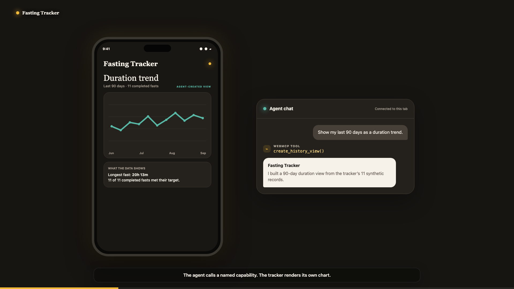
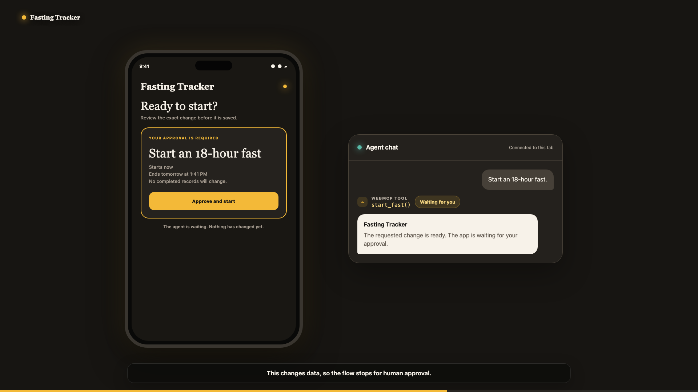

# Fasting Tracker

Fasting Tracker is a real, iPhone-first timer and journal with an optional agent control surface. The human interface is the product. WebMCP lets a compatible chatbot use 17 named capabilities that the application defines and limits.

[Open the credential-free demo](https://fasting-tracker-webmcp-demo.harnden-trey.workers.dev/) · [Watch the 1:41 demo](https://www.youtube.com/watch?v=YrP55Q2LqAE) · [Read the video script](video/SCRIPT.md) · [View the WebMCP Challenge](https://openai.com/webmcp-challenge/)



## What it does

Use the tracker normally to start a fast, see the timer, correct an active start time, and review completed history. The app can also build six history views, compare periods, trace an insight back to its source records, preview several fasting schedules, and run a user-defined tracking experiment.

When `document.modelContext` is available, the signed-in page registers a bounded WebMCP toolset. An agent can read tracker data, compose app-owned views, make reversible layout changes, and request a small set of data changes. The app still controls validation, confirmation, storage, and audit evidence.

## Try the agent path

1. Open the [public demo](https://fasting-tracker-webmcp-demo.harnden-trey.workers.dev/). It uses synthetic records and does not ask for credentials.
2. Copy one of the three prompts in the first panel into a WebMCP-enabled agent.
3. Watch the tracker render its own chart, evidence highlight, or decision preview.
4. Use **Reset demo data** to restore the 11-record starting state.

Strong first prompts:

```text
Show my last 90 days as a duration trend.
Highlight the records behind my longest fast.
Compare 16, 18, and 20-hour options without starting a fast.
```

## Why WebMCP fits this app

The agent does not need broad account access or brittle screen guessing. It calls capabilities chosen by the application, such as `create_history_view`, `highlight_history_records`, and `preview_fasting_decision`. The same React app renders the result for the person using it.

| The agent can | The agent cannot |
| --- | --- |
| Read the active fast and recent history | Sign in for the user |
| Build supported charts from tracker data | Delete fasting history |
| Highlight the records behind an explanation | Rewrite a completed record |
| Preview user-selected fasting options | Reach admin controls |
| Request a confirmed timer or experiment change | Provide medical advice |

Reversible view changes happen in the open tab. Any action that saves fasting or experiment data requires a visible confirmation. The Worker independently enforces authentication, exact same-origin checks, JSON content, CSRF protection, validation, idempotency, and append-only audit evidence.



## Architecture

```text
Human or chatbot
       |
       v
React PWA in the signed-in tab
       |
       +-- Human controls
       +-- 17 browser WebMCP tools
       |
       v
Cloudflare Worker security boundary
       |
       v
Cloudflare D1
```

Production and demo use the same source, but separate Workers, D1 databases, sessions, and secrets. Demo mode hides the admin API and remote MCP endpoint. Its reset route exists only in the demo Worker and restores synthetic data.

The repository also includes a remote MCP server for a separately authorized trusted agent. That server is not enabled in the public demo and is not required for the WebMCP experience.

More detail: [architecture](docs/architecture.md) · [capability contract](docs/webmcp-capabilities.md) · [judge demo flow](docs/demo-flow.md) · [Challenge provenance](docs/challenge-provenance.md) · [QA report](docs/qa-report-2026-09-02.md) · [Devpost draft](devpost-submission.md)

## Run it locally

Requirements: Node.js 22 or newer and a Cloudflare account for deployed D1 testing.

```bash
npm install
npm run db:migrate:demo:local
npm run db:seed:demo:local
npm run preview:demo
```

The full deterministic check is:

```bash
npm run check
npm test
npm run build
```

Copy `.dev.vars.example` to the ignored `.dev.vars` file only when testing the authenticated production mode. Replace the placeholder D1 IDs in the Wrangler configs before deployment. Never commit plaintext passwords, tokens, cookies, or generated secret output.

## Render the demo video

The video package keeps app screens, chatbot messages, tool calls, captions, and safety claims editable in Remotion. MiniMax contributes one text-free atmospheric opening plate. It never generates readable product UI.

```bash
cd video
npm install
npm run typecheck
npm run render:draft
```

The 16:9 master is 1 minute 40 seconds. A separate 9:16 composition reuses the same scene system for mobile sharing.

## License

MIT. See [LICENSE](LICENSE).

Fasting Tracker is a timer and journal, not medical advice. Choose targets that are appropriate for you, stop if you feel unwell, and ask a qualified healthcare professional if fasting is right for you.
